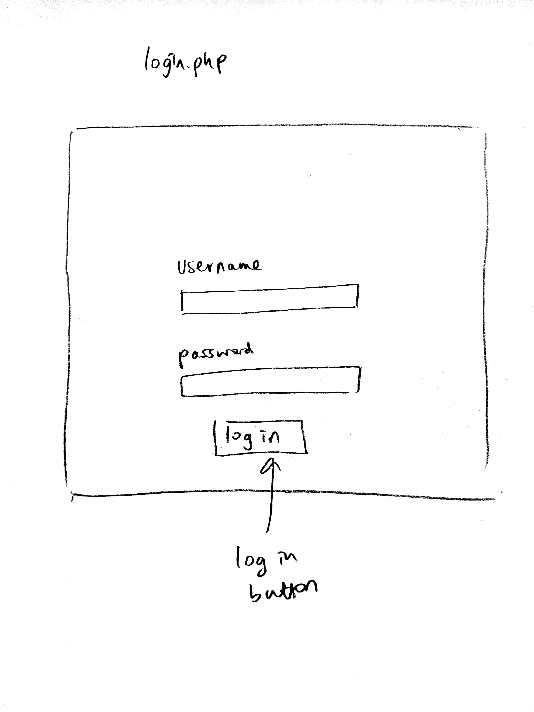
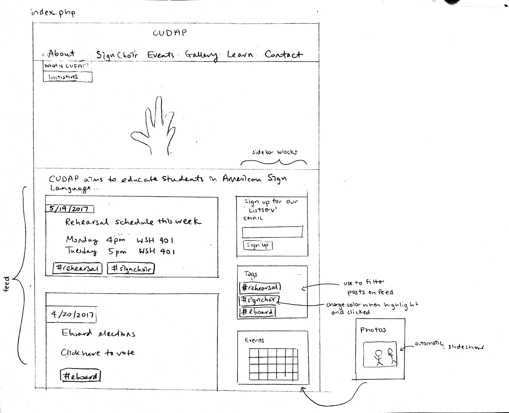

# Project 4 - Design & Plan

Your Team Name: Red Elephant

## Milestone 1, Part II: Client Selection

### Client Description

Our client will be CUDAP, the Cornell University Deaf Awareness Project, which is a club under SAFC and the Public Service Center. CUDAP was created 7 years ago when there was an emergency situation in Ithaca and someone needed an interpreter, but there was none available. Then, a Cornell student stepped in who was not certified, and thus CUDAP was founded. CUDAP provides students with opportunities to learn about and participate in raising awareness concerning the issues facing the Deaf community through meetings, service trip, events, and incorporating ASL into the school-year curriculum at Cornell.

The club part of this program involves general body meetings, where the members present a powerpoint of signs with a theme to increase awareness of ASL and teach popular songs in ASL and perform them, and they conduct workshops with different groups on campus. CUDAP just recently brought SA initiative 41 (establishing American Sign Language ASL classes to fulfill the foreign languages requirement at Cornell) to the Student Assembly and it passed unanimously!

CUDAP would like a website that is user-friendly and promotes more interaction with their program for students, club members, and Ithaca residents by announcing events, teaching some basic signs, and providing contact information. One of their goals is to also have a website that can be updated easily with an admin feature so they don't have to code.

These are some main ideas that CUDAP would like us to promote in our website:
	- Increasing awareness, recruiting, getting more involved
	- Accessible to the community, not just the club

Some possible pages of our website:
	- About page *** need to have ***
	- Meet the Board page (contact info) *** need to have ***
	- G-body info, events --> a NewsFeed maybe? Instead of an announcements page
	- Photo gallery
	- Information page with links to different resources
	- A learning page for a crash-course of Sign Language → few common signs displayed for better User Experience

The key goals of CUDAP are stated in their three-fold mission:
1. Work to integrate the Deaf and hearing communities
2. Work to provide an opportunity for students to learn about the Deaf community and American Sign Language (ASL) through meetings, service trips, and events, while educating the Cornell campus and the greater Ithaca community to facilitate a better understanding of the Deaf community.
3. Aim to incorporate ASL into the school-year curriculum at Cornell University.

Existing website: http://orgsync.rso.cornell.edu/org/cudap/home

Screenshot: 

Update the site: The website is currently run through OrgSync, which is a platform that limits user choices. We plan on redesigning the content of the website in a more eye-appealing manner. Also, we plan on restructuring the pages on the website and adding a "learning" page where CUDAP can control uploading a picture of a sign and it's meaning. The homepage will feature a feed where they can announce current happenings with the program or promote Deaf awareness in other ways. We will be making this website mobile-friendly and implementing a header instead. Lastly, we will be including a log-in feature for the admin to update existing board members, photo galleries, the homepage feed, and the learning page.


## Milestone 1, Part III: Client Requirements

### Target Audience(s)

The potential audiences for this website will include anyone who wants to know about the deaf community & ASL experience, potential people interested in the club, people already involved with the club and are members, alumni of the program, officers of the club (admins), and Ithaca residents.

For the people who would want to learn more about the deaf community, they would not necessarily have an affiliation with Cornell or want to be involved in the program, so they would use this website as an informative site.

Potential people who are interested in the club would probably use the website most during the beginning of semesters around club fest. They would also utilize the "sign up for the listserv" feature.

Members of the club and alumni could use the website as supplemental to the weekly emails that the program sends out. They would also use it to keep up with events.

The officers would need to access the website from an admin portal to update content like officers, pictures, posts, and learning material.

Ithaca residents would use this website year round for if they wanted to contact the club for some reason or become involved with events offered by the program.

### Purpose & Content

The purpose of this website will be...
* promoting CUDAP
* promoting the deaf community and raising awareness
* recruiting for their club
* let members know about events and announcements

CUDAP will be using the website to appeal to their target audiences and display information about what their program offers to increase awareness of the deaf community. For the information portion, there will be a page with pictures of members signing some basic ASL signs as a kind of "crash-course" and to stimulate interest in the club and the deaf movement. The events page will integrate a calendar so the audience can get involved if they choose. Additionally, the website will include the student involvement side (the club aspect) and explain what they do on campus, introduce their e-board, and show action pictures.

### Needs and Wants

* Needs/Wants #1
	* **Needs and Wants**
		* Client is required to have an About page to satisfy requirements as an organization under the Public Services Center, and wants the flexibility to change this information
	* **Design Ideas and Choices**
		* Create an About page that describes the organization and its goals and initiatives
		* Keep the structure of this page simple and allow webmaster to change the text in HTML if changes are needed
		* Create an Update About Page with HTML form on the website which can only be accessed by members who can log in to the admin pages
	* **Memo**
		* We will allow the webmaster to make changes via an HTML form, but also leave instructions as to how changes in HTML can be made. The club has members well versed in programming languages, so maintaining the website should not be a difficult task


* Needs/Wants #2
	* **Needs and Wants**
		* Client would like the ability to update the Meet the Board page for each new E-board
	* **Design Ideas and Choices**
		* Allow webmaster to make changes in HTML
		* Create an Update E-board page as an admin page that can only be viewed members of the e-board. Provide an HTML form that allows users to delete existing members and another form for adding the new e-board (name, email, description, photo)
	* **Memo**
		* Both options are viable, but it is probably better to allow updates to be made on the admin pages for a more user-friendly interface, and to prevent code from being tampered with. We want to make this website self-sustaining so that even those unfamiliar with HTML/CSS/PHP have the ability to make changes when necessary


* Needs/Wants #3
	* **Needs and Wants**
		* Client wants a learning page to share ASL resources with members and the general public
	* **Design Ideas and Choices**
		* Create a page and display links to different websites
		* Create a photo gallery with different pictures of signs and allow users to hover over it/click on it to see its meaning
	* **Memo**
		* We think that the second option would be more effective because it is attention-grabbing and different from how websites usually present information
		* We could still display relevant links at the bottom of the page for those who are interested in delving deeper


* Needs/Wants #4
	* **Needs and Wants**
		* Client would like a calendar to list organization events on the website
	* **Design Ideas and Choices**
		* Embed a Google calendar onto one of the pages
		* Create a list of events on one of the pages, providing date, time, and event details
	* **Memo**
		* We will likely embed the Google calendar in the version of the website that we submit to the client, but create a list of events for the website that we submit for class to satisfy project requirements


### Hosting Plan

We will not be hosting our website for the client, as stated by the requirements of this project. But we can give them the files for the website and they can host the website. We have notified the client of this.

### Client's Edits

Yes. We will implement different forms for changing/updating the content of the website for the admins. For instance, our website would have a form for uploading different content on the feeds/announcement section in the home page (only visible/accessible by admins)

### Information Architecture, Content, and Navigation

* Content #1
  * **Main Navigation**
		* Home
    * About
			* Initiatives
      	* Goal 1
      	* Goal 2, etc
    * Meet the Board
    * Sign Choir
  * **Content**
		* Home: This page shall contain some general photos of the club, a feed system that displays information about the organization's upcoming events and/or announcements. The closest 5 events and announcements will be shown, but the user will be given the opportunity to expand the list of events if they so choose (if we choose to implement this functionality). Each event shall have a title, time, location, and brief description. These events will be provided by the client.
    * About: The About link in the main navigation should like to the About page necessitated by Public Services Center requirements which contains general information about the organization, its goals, and its initiatives. This information will be obtained from the client.
    * Meet the Board: A link to this page shall be displayed in a dropdown menu that appears when About is hovered over. This page will contain photos and short bios for each of the organization's eboard members. These photos and bios will be obtained from the client. As for the initiatives, the organization has a few major goals (project initiatives), and each one will have its own bullet describing the goal, the steps that have been taken to reach the goal, the steps that the organization plans to take to reach the goal, and how far they are to reaching the goal. The information for this page will be provided by the client.
    * Sign Choir: This page should contain information about the organization's Gbody meetings including where and when they are held, and the activities conducted at the meetings. This information will be obtained from the client.

* Content #2
  * **Main Navigation**
    * Learning
  * **Content**
    * Learning: This page shall contain the various resources that the organization provides for people who are interested in learning ASL. It will incorporate an interactive gallery of signs which displays the meaning of each sign when it is hovered over. It will also contain links to external resources for more advanced study.
		* Events: This page will contain a table of events that are coming up.

* Content #3
  * **Main Navigation**
    * Photo Gallery
  * **Content**
	This page will contain a gallery and slideshow of photos taken during their events and activities. These photos will be provided by the client.

* Content #4
  * **Main Navigation**
    * Contact
  * **Content**
    * This page shall contain contact information for important members of the eboard, and contain information on who to contact for whatever purpose. It should also contain a contact form.

### Interactivity

We will implement a slideshow using Javascript, which the user can click arrows to view several images of the club activities like sign choirs and photos of club members interacting with one another in sign language. Such feature can help induce interest in potential club members and also to increase awareness of American Sign Language in people who view these photos.

We will use PHP to implement a "learning" page where users can learn some basic signs of ASL, and there will be several images with different signs and when user clicks on it, the website would display information on what it means, etc. This interactive feature will help CUDAP achieve one of their main goals of providing an opportunity for students to learn about sign language.

Lastly, we will implement a hidden log-in system to ensure that only admins will have access to admin functionality (forms for changing content on website). ~~There will most likely be an "secret" button (e.g., CUDAP logo) on the home page that will direct the user to a page with a log-in form, which only the admins will know the password to log-in and unlock admin functionality.~~ **Update (M2): there will be a url provided to e-board/admins who can put that in the browser to get to the log-in form, and once they're logged in, they will be able to see an "Admin" page on the navigation bar, which will contain all the forms necessary to update content on the website. (change made after doing cognitive walkthrough for Abby persona)**

### External Code

We are planning to use jQuery, so that we can implement the slideshow mentioned in previous section. There will be a whole new file of our own code called "slideshow.js" that would contain the code for implementing a simple slideshow for our photo gallery.

### Scale

The site will contain 10 pages, but this number is subject to change. We estimate that the project will take approximately 150 hours to complete. This includes time for planning, designing, building, and testing the website with our client and target audience.

## Milestone 1, Part IV: Work Distribution

Initial planning and preparation work has been equally divided between all team members.

In order to ensure a fair distribution of work and an equal learning experience for all group members, we aim to distribute some design, front end development, back end development, and testing responsibilities to all team members. However, in order to most effectively leverage the specific skills of each team member, a larger proportion of the work distributed to each team member will be under a category that that person is skilled at.

For instance, if Autumn is a strong designer, she will hold a larger proportion of design responsibilities than other team members, but will still have programming and testing responsibilities.

Specific work distributions are listed below (subject to change):

| Autumn | Lucy | Bethany | Derek |
|----------------------------------------|------------------------------------------------|-------------------|--------------------------------------------------------|
| Talking with the client, understanding their goals; End goal: get necessary information | Organize/plan interactive components; End goal: Facilitate implementation of forms, interactive component (slideshow, etc.) as the entire team works on it | Give feedback on design; End goal: Suggest/outline overall style/layout, so the entire team can start discussing what works best | Plan admin-specific features; End goal: Keep track of these features (hidden features, login, etc.) so that the whole team can work on them efficiently |

*These are our main responsibilities, but we will all work on the code and design distributively.*

- Log in feature implemented by certain time, most likely before end of April
- We need to create databases first before we can get started working on the photo gallery and the learning page.
- We will first need the basic  website before we do admin-specific hidden features with the log-in and hidden elements.

**Preliminary timeline (subject to change):**

| Deadline/Date | Action |
|---------------|-----------------------------------------------------|
| 4/17 | Milestone 1 submission |
| 4/20 | Discuss preliminary sketches and database structure |
| 4/23 | Review wireframes |
| 4/24 | Milestone 2 submission |
| 4/26 | Complete basic website structure |
| 4/29 | Implement HTML page layouts and CSS |
| 4/31 | Implement login system and add client content |
| 5/1 | Milestone 3 submission |
| 5/3 | Make presentation |
| 5/4 | Milestone 4: present in lab |
| 5/8 | Implement front-end dynamic features |
| 5/12 | Implement back-end (admin) dynamic features |
| 5/13 | Implement any extra features |
| 5/15 | Review and bug test |
| 5/16 | Milestone 5: final submission |

This section will be updated as we set more concrete tasks to complete.


## Milestone 1, Part V: Additional Comments

CUDAP would like to have an events page on their website. Given that CUDAP already has a Google Calendar to keep track of their events, and that such functionality is already very effectively implemented by Google Calendar, the ideal way to implement the events page is to use the Google Calendar API. However, since this does not conform to the final project rules, we will be implementing two versions of the event page. One version will be a PHP implementation backed by an events table in our database. This will be submitted for the class. A second version will use the Google Calendar API, and this will be delivered to the client.


## Milestone 2, Part I: PHP Interactivity

[Describe here what you plan to do for your PHP Interactivity requirement.]

As mentioned in milestone 1 plan, we will implement a slideshow using Javascript, which the user can click arrows to view several images of the club activities like sign choirs and photos of club members interacting with one another in sign language.

Secondly, we will use PHP to implement a "learning" page where users can learn some basic signs of ASL, and there will be several images with different signs and when user clicks on it, the website would display information on what it means, etc.
Similar interactivity element will be used for the photo gallery page, where users can click on images to see only that image on the page and its description.

Thirdly, we will implement a hidden log-in system to ensure that only admins will have access to admin functionality (forms for changing content on website). There will most likely be an "admin-only" nav bar button that shows the log-in form, which only the admins will know the password to log-in and unlock admin functionality.


## Milestone 2, Part II: Sketches, Navigation & Wireframes

### Sketches

1. Home/Feed: 

2. About CUDAP: 

3. Meet the Board: 

4. Sign Choir: 

5. Photo Gallery: 

6. Events: 

7. Learning: 

8. Resources: 

9. Contact: 

10. Login: 

11. Admin: 


### Navigation

[What will be your top-level pages and your sub-pages for those top-level pages? What will your website's navigational structure?]

[Tip: If you use card sorting for your navigation, show us that work by including a picture!]

These will be the pages we are planning on
* Home (top-level, maybe not in nav bar)
* About
  * About CUDAP
	* Meet the Board
* Sign Choir - G-body info, some photos
* Events - Google calendar, a makeshift calendar for class
* Gallery - photos of past events
* Learning (weekly updated??)
	* ASL signs page
	* Resources (PowerPoints and links)
* Contact

We plan to implement a navigation menu that will be our header. However, when the width of the browser gets below a minimum width set, we will collapse the navigation bar.

### Wireframes

[Insert your wireframes here.]

Home: 

About CUDAP: 

Meet the Board: 

Sign Choir: 

Events: 

Gallery: 

ASL Signs: 

Resources: 

Contact: 

Login: 

Admin: 

## Milestone 2, Part III: Evaluate your Design

[Use the GenderMag method to evaluate your wireframes.]

[Pick a persona that you believe will help you address the gender bias within your design. Tell us why you picked your persona in 1-3 sentences. Your explanation should include why your persona will help you address gender-inclusiveness bugs in your design.]

We've selected **Abby** as our persona. She is suitable because our website has a wide range of audiences, from those who feel more comfortable using technology and enjoy learning by tinkering, to those who prefer perusing static webpages to access the information that they need.

Abby represents users who already have some familiarity with using technology to accomplish tasks, but has low confidence about doing unfamiliar computing tasks, and is risk averse about using unfamiliar technologies that might need her to spend extra time on them. We want to design our webpage so that it is easily accessible to such a group of users, by focusing on presenting information in a well-structured manner, and creating tools (mainly forms) that are consistent across the website and follow the same methodical steps.

Most of the executive board members and club members are female, so Abby would also be representative of the major users of the website. We will design our website with Abby in mind to help address gender-inclusiveness bugs in our design.


### Tasks

[You will need to evaluate at least 3 tasks (known as scenarios in the GenderMag literature). List your tasks here. These tasks are the same as the task you learned in INFO/CS 1300.]

[For each task, list the ideal set of actions that you would like your users to take when working towards the task.]

Task 1: Suppose that it is the start of a new academic year, and Abby is an incoming board member of CUDAP. She wishes to update the profiles of the executive board members on the website.

1. Click on hidden button (CUDAP logo) to access login.php
2. Type in username and password, then click Log In
3. Look at the sidebar on the left, and click to update Meet the Board page
4. Using the delete members form, delete all existing members
5. Using the add members form, complete information for each e-board member and submit
6. Check the Meet the Board page now to see that new e-board members have been updated


Task 2: Suppose that Abby is a freshman at Cornell. She stopped by CUDAP's booth at Club Fest and is interested in learning more about the Sign Choir meetings that the club holds every week.

1. Type index.php (or rather the URL) in the browser
2. Click on Sign Choir in the nav bar
3. Peruse relevant information to learn about the club's activities


Task 3: Suppose that Abby is a member of the club, and would like to check the time for practice this week.

1. Visit website
2. Click on Events
3. Access the calendar on the Events page to look up rehearsal time

### Cognitive Walkthrough

[Perform a cognitive walkthrough using the GenderMag method for all of your Tasks. Use the GenderMag template in the <documents/gendermag-template.md> file.]

#### Task 1 - Cognitive Walkthrough

**Task name: Update E-board**

**Subgoal #1: Access login.php**

  - Will Abby have formed this sub-goal as a step to their overall goal?
    - Yes, maybe or no: Yes
    - Why? (Especially consider Abby's Motivations/Strategies.)

        Assuming that Abby has been properly briefed by the previous E-board to know this is a hidden button, she will have clicked on the CUDAP logo in the header of the main pages. However, this reveals the issue that normal users like Abby may accidentally click on the CUDAP logo and be confused as to what the login.php page is since they aren't an admin.


**Action #1: Type in the username and password, the click Log In**

  - Will Abby know what to do at this step?
    - Yes, maybe or no: Yes
    - Why? (Especially consider Abby's Knowledge/Skills, Motivations/Strategies, Self-Efficacy and Tinkering.)

      Abby has some experience using technologies to accomplish her tasks. A standard login page should be something that she is already familiar and comfortable with.

  - If Abby does the right thing, will she know that she did the right thing, and is making progress towards her goal?
    - Yes, maybe or no: Yes
    - Why? (Especially consider [persona name]'s Self-Efficacy and Attitude toward Risk.)

        Abby will be taken to the admin page if she successfully logs in. If not, there will be an error message below the login form.

**Action #2: Click Update Meet the Board page**

  - Will Abby know what to do at this step?
    - Yes, maybe or no: Yes
    - Why? (Especially consider Abby's Knowledge/Skills, Motivations/Strategies, Self-Efficacy and Tinkering.)

    Yes, Abby learns best through process oriented learning or step-by-step processes. It should be intuitive for Abby to click on the Update Meet the Board link on the sidebar. In addition, the sidebar provides the admin user the ability to update all the other pages, and provides comprehensive information for Abby.

  - If Abby does the right thing, will she know that she did the right thing, and is making progress towards her goal?
    - Yes, maybe or no: Yes
    - Why? (Especially consider [persona name]'s Self-Efficacy and Attitude toward Risk.)

		Upon clicking on the link, the update Meet the Board forms will appear on the right side of the webpage. This should all be familiar to Abby.

**Action #3: Use delete members form to delete all existing members**

  - Will Abby know what to do at this step?
    - Yes, maybe or no: Yes
    - Why? (Especially consider Abby's Knowledge/Skills, Motivations/Strategies, Self-Efficacy and Tinkering.)

		A form is something that Abby should be familiar with, even with limited exposure to technology. In addition, the form follows a step by step process. Abby has to first select the member that she would like to delete. Then she needs to click the delete button.

  - If Abby does the right thing, will she know that she did the right thing, and is making progress towards her goal?
    - Yes, maybe or no: Yes
    - Why? (Especially consider [persona name]'s Self-Efficacy and Attitude toward Risk.)

		Feedback will be provided to Abby to inform her that the persona has been deleted. In addition, Abby can verify this by clicking the Meet the Board page on the nav bar.


**Action #4: Using the add members form, fill out information for each e-board member and submit**

  - Will Abby know what to do at this step?
    - Yes, maybe or no: Yes
    - Why? (Especially consider Abby's Knowledge/Skills, Motivations/Strategies, Self-Efficacy and Tinkering.)

		Again, a form is something that Abby should be familiar with. The form takes Abby through the process step by step. First she needs to fill out the e-board member's information. Required fields will be indicated. Then, Abby should click the submit button.

  - If Abby does the right thing, will she know that she did the right thing, and is making progress towards her goal?
    - Yes, maybe or no: Yes
    - Why? (Especially consider [persona name]'s Self-Efficacy and Attitude toward Risk.)

		Yes, the form will provide feedback to Abby to inform her if the e-board member has successfully been added, or whether she will have to input the information again.

**Action #5: Check the Meet the Board page to see that new e-board members have been updated**

  - Will Abby know what to do at this step?
    - Yes, maybe or no: Maybe
    - Why? (Especially consider Abby's Knowledge/Skills, Motivations/Strategies, Self-Efficacy and Tinkering.)

		Abby will mostly likely want to check that the e-board members have been updated. This is the most logical way of doing it. Of course, Abby could also just skip this step if she is confident that the update form has already provided her with all the information that she needs - i.e. everything has been successfully updated.

  - If Abby does the right thing, will she know that she did the right thing, and is making progress towards her goal?
    - Yes, maybe or no: Yes
    - Why? (Especially consider [persona name]'s Self-Efficacy and Attitude toward Risk.)

		Yes, if she clicks on the Meet the Board page on the nav bar, she will be able to view all the updated profiles of incoming e-board members.


#### Task 2 - Cognitive Walkthrough

**Task name: Learning about Sign Choir Meetings**

**Subgoal #1: Visit CUDAP website**

  - Will Abby have formed this sub-goal as a step to their overall goal?
    - Yes, maybe or no: Yes
    - Why? (Especially consider Abby's Motivations/Strategies.)

    	Assuming that CUDAP has done its advertising well, people interested in CUDAP should have access to its URL. Abby should be familiar with the process of visiting websites for more information.

**Action #1: Click on Sign Choir tab in nav bar**

  - Will Abby know what to do at this step?
    - Yes, maybe or no: Maybe
    - Why? (Especially consider Abby's Knowledge/Skills, Motivations/Strategies, Self-Efficacy and Tinkering.)

    	Abby is risk averse about using unfamiliar technologies. The items in the nav bar should be fairly self explanatory and predictable.

  - If Abby does the right thing, will she know that she did the right thing, and is making progress towards her goal?
    - Yes, maybe or no: Yes
    - Why? (Especially consider [persona name]'s Self-Efficacy and Attitude toward Risk.)

    	Yes, clicking on a tab in the nav bar should be fairly intuitive, even for Abby.

**Action #2: Look for relevant information on Sign Choir page**

  - Will Abby know what to do at this step?
    - Yes, maybe or no: Yes
    - Why? (Especially consider Abby's Knowledge/Skills, Motivations/Strategies, Self-Efficacy and Tinkering.)

    	Abby likes to gather information comprehensively to try to form a complete understanding of the problem before trying to solve it. The Sign Choir should provide Abby with all the information that she needs to know about the club (CUDAP) and its activities.

  - If Abby does the right thing, will she know that she did the right thing, and is making progress towards her goal?
    - Yes, maybe or no: Yes
    - Why? (Especially consider [persona name]'s Self-Efficacy and Attitude toward Risk.)

    	Again, Abby should be familiar with this task - gathering information from webpages.

#### Task 3 - Cognitive Walkthrough

**Task name: Checking practice time for the week**

**Subgoal #1: Access the CUDAP website**

  - Will Abby have formed this sub-goal as a step to their overall goal?
    - Yes, maybe or no: Yes
    - Why? (Especially consider Abby's Motivations/Strategies.)

        Again, we would assume that Abby knows of the CUDAP website, or might even have it bookmarked.


**Action #1: Click on the Events tab in the nav bar**

  - Will Abby know what to do at this step?
    - Yes, maybe or no: Yes
    - Why? (Especially consider Abby's Knowledge/Skills, Motivations/Strategies, Self-Efficacy and Tinkering.)

		This should be a task that Abby is familiar and comfortable with. She does not need to spend extra time tinkering with unfamiliar features.

  - If Abby does the right thing, will she know that she did the right thing, and is making progress towards her goal?
    - Yes, maybe or no: Yes
    - Why? (Especially consider [persona name]'s Self-Efficacy and Attitude toward Risk.)

		Yes, she will be taken to the Events page if she successfully clicks on the correct tab on the nav bar.


**Action #2: Access the calendar on the events page to look up rehearsal time**

  - Will Abby know what to do at this step?
    - Yes, maybe or no: Yes
    - Why? (Especially consider Abby's Knowledge/Skills, Motivations/Strategies, Self-Efficacy and Tinkering.)

		Yes, this is the only information that will be presented on the page, so it should be logical for Abby to scroll through events on the calendar. The calendar also provides Abby with comprehensive information about other events that the club is hosting in the next month or two.


  - If Abby does the right thing, will she know that she did the right thing, and is making progress towards her goal?
    - Yes, maybe or no: Yes
    - Why? (Especially consider [persona name]'s Self-Efficacy and Attitude toward Risk.)

		She will be able to obtain practice times for the week using the calendar.


### Cognitive Walk-though Results

[Did you discover any issues with your design? What were they? How did you change your design to address the gender-inclusiveness bugs you discovered?]

A side result result of Cognitive Walkthrough Task #1 was that we originally were planning on using the CUDAP logo as a "secret" button for the admin to access the admin login page login.php. However, it would be confusing for general users to stumble upon the login page, so we decided to designate a url for just the admins that directs to login.php so that the general public does not encounter this page.

We addressed gender-inclusiveness bugs by ensuring that all features of the website are easily accessible and designated properly on the webpage. We also made sure to include some information on multiple webpages (like the Listserv join form) on the front feed page and on the contact page because a user like Abby would make sure to not miss this information that CUDAP wants to make sure they see.

[Your responses here should be very thorough and thoughtful.]


## Milestone 2, Part IV: Database Plan

### Database Schema

Table: users
* **id**: integer (PK, AI, unique, non-null)
  * surrogate key for users
* **username**: text (unique, non-null)
  * another natural key for users
* **password**: text (non-null)
  * will be stored in hashed form
* **session**: text (unique)
  * stores session

Table: eboard
* **id**: integer (PK, AI, unique, non-null)
 	* surrogate key for eboard member
* **name**: text (non-null)
	* full name of eboard member
* **position**: text (non-null)
	* position of eboard member
* **major**: text (non-null)
	* major of eboard member
* **class**: integer (non-null)
	* year eboard member is graduating
* **year**: integer (non-null)
	* year eboard member started signing (can write a formula for how many years of experience from this number)
* **bio**: text (non-null)
	* a short bio for the eboard member (2-3 sentences)
* **image**: text (non-null)
	* file name of image of eboard member (to be uploaded to images/eboard folder)

Table: signs
* **id**: integer (PK, AI, unique, non-null)
	* surrogate key for the sign
* **sign**: text (non-null)
	* english translation of the sign
* **info**: text (non-null)
	* information on how to properly produce this sign
* **image**: text (non-null)
	* file path of image showing this sign (to be uploaded to images/signs folder)

#### Tables for Gallery Page

Table: images
* **id**: integer (PK, AI, unique, non-null)
  * surrogate key for images, also file name when stored
* **title**: text (non-null)
  * title of image
* **file_ext**: text (non-null)
  * file type of the image, could be png or jpg or whatever

Table: categories
* **id**: integer (PK, AI, unique, non-null)
  * surrogate key for categories
* **name**: text (unique, non-null)
  * the name of the category, a natural key

Table: images_cats
* **image_id**: integer (non-null)
  * id of the the image in an image-category relationship, a foreign key linked to the primary key of the images table
* **cat_id**: integer (non-null)
  * id of the category in an image-category relationship, a foreign key linked to the primary key of the categories table
* this table facilitates the many-to-many relationship between images and categories
* records in this table will be unique by means of a query checking if an image-category pair already exists in the table before inserting a new image-category pair into the table

Table: events
* **id**: integer (PK, AI, unique, non-null)
	* surrogate key for event
* **title**: text (non-null)
	* title of the event
* **date**: datetime (non-null)
	* date and time of the event
* **description**: text (non-null)
	* short description of the event

### Database Queries

### Uploading an image (and adding categories)

When users upload an image, they have the option to specify a caption. Depending on if they decide to do so, one of the following queries will be used:

```
INSERT INTO images (title, caption, file_ext) VALUES (:title, :caption, :file_ext);
INSERT INTO images (title, file_ext) VALUES (:title, :file_ext);
```

There will be a field in the image upload form to permit the user to specify tags they want to add to their image in a comma-separated format (tag1, tag2, tag3, etc). This string will be parsed to separate the tags into individual strings, and they will be placed in an array.

First, we will use the following line of PHP to get the ID of the image that was just uploaded:

```
$image_id = $db->lastInsertID("id");
```

We would then use the following query for each string in said array:

```
SELECT * FROM categories WHERE name = :name;
```

If the result of the above query is null, this means the category does not yet exist. It will thus be added to the categories table with the following query:

```
INSERT INTO categories (name) VALUES (:name);
```

The following PHP code will be used to save the ID of the category that was just added:

```
$tag_id = $db->lastInsertID("id");
```

Finally, the category will be associated with the image through the following query:

```
INSERT INTO images_cats (image_id, cat_id) VALUES (:image_id, :cat_id);
```

Note that each image's page will also contain a form to add/remove categories to that image, if the user is logged in. If the user uses that form to add categories to the image, the same approach described above will be taken, with the added step of checking first if a category entered by the user is already associated with that image, in which case that category will not be added.

### Removing an image or category

Each image page will include a button for deleting the image that displays only when the user is logged in. If the user chooses to delete the image, we will use the following queries:

```
DELETE FROM images WHERE id = :image_id;
DELETE FROM images_cats WHERE image_id = :image_id;
```

The user will also be allowed to add and remove categories. This will probably be done in an admin page. The following queries will be used:

```
DELETE FROM categories WHERE id = :category_id;
INSERT INTO categories (name) VALUES (:name);
```

### Adding/removing events, eboard members, and signs

The queries used here are simple INSERT INTO and DELETE FROM queries that add and remove the relevant records. We may also implement a form that allows the user to change a record in addition to adding and deleting. This would use an UPDATE query. There is not too much involved in this.

### Logging in and out

This will be done in a similar manner to what was shown during lecture.

## Milestone 2, Part V: Structure and Pseudocode

### Structure

[List the PHP files you will have. You will probably want to do this with a bulleted list.]

* includes/init.php
* includes/head.php
* includes/header.php
* includes/footer.php
* index.php - main page
* about.php
* meettheboard.php
* signchoir.php
* events.php
* gallery.php
* signs.php
* resources.php
* login.php
* admin.php

### Pseudocode

[For each PHP file, plan out your pseudocode. You probably want a subheading for each file.]

#### index.php

```
Pseudocode for index.php...

include init.php

include navigation.php, header.php, footer.php

$current_page = "index";

slideshow --> on the side
pseudocode written in Javascript:

$(document).ready(function() {
	// the array of images
	// Image source: E.Motion executive board
	var images = ["images/groupphoto.jpg", "images/groupphoto2.jpg", "images/groupphoto3.jpg"];

	//Set the current image to image 0
	$("#current_img").attr("src", images[0]);
	var slideIndex = 0;
	// When the left button is clicked:
	document.getElementById("left").onclick = function() {
		if (slideIndex == 0) {
			slideIndex = images.length - 1
			$("#current_img").attr("src", images[slideIndex]);
		} else {
			slideIndex -= 1;
	    $("#current_img").attr("src", images[slideIndex]);
		}
	}
	document.getElementById("right").onclick = function() {
		if (slideIndex == (images.length - 1)) {
			slideIndex = 0;
			$("#current_img").attr("src", images[slideIndex]);
		} else {
			slideIndex += 1;
		  $("#current_img").attr("src", images[slideIndex]);
		}
	}
```

#### includes/init.php

```
messages = array to store messages for user (you may remove this)

// DB helper functions (you do not need to write this out since they are provided.)

db = connect to db

title variable

pages array for navigation bar

function add_message($message) {
  global messages
  array_push
}

function display_message() {
  global messages
  foreach (messages as message) {
    echo it
  }
}

// DB helper functions (you do not need to write this out since they are provided.)
$db = open_or_init_sqlite_db("website.sqlite", "init/init.sql");

For log in and log out: **We will include all the code from the demo from lecture**

function check_login() {
	global $db;
	if (isset($_COOKIE["session"])) {
		$session = $_COOKIE["session"];
		$sql = "SELECT * FROM accounts WHERE session = :session_id;";
		$params = array (
			":session_id" => $session,
		);
		$records = exec_sql_query($db, $sql, $params)->fetchAll();
		if ($records) {
			$account = $records[0];
			return $account["username"];
		}
	}
	return NULL;
	}

function log_in($username, $password) {
	global $db;
	if ($username && $password) {

		$db->beginTransaction();

		$sql = "SELECT * FROM accounts WHERE username = :username;";
		$params = array(
			':username' => $username
		);
		$records = exec_sql_query($db, $sql, $params)->fetchAll();
		if ($records) {
			// Username is UNIQUE, so there should only be 1 record.
			$account = $records[0];
			if ($account['password'] == $password) {
				// Generate session
				// Warning: Not a secure method for generating a session id
				// TODO: secure session
				$session = uniqid();
				$sql = "UPDATE accounts SET session = :session WHERE id = :user_id;";
				$params = array (
					":user_id" => $account['id'],
					":session" => $session
				);
				$result = exec_sql_query($db, $sql, $params);
				if ($result) {
					// Success, session stored in DB
					// Send this back to the client
					setcookie("session", $session, time()+3600);
					record_message("Logged in as $username");
					return $username;
				}
			} else {
				record_message("Invalid username or password.");
			}
		} else {
			record_message("Invalid username or password.");
		}
		$db->commit();
	} else {
		record_message("No username or password given.");
	}
	return NULL;
}

function log_out() {
	global $current_user;
	global $db;
	if ($current_user) {
		$db->beginTransaction();
		$sql = "UPDATE accounts SET session = :session WHERE username = :username;";
		$params = array (
			":username" => $current_user,
			":session" => NULL
		);
		if (!exec_sql_query($db, $sql, $params)) {
			record_message("log out failed.");
		}
		//
		setcookie("session", "", time()-3600);
		$current_user = NULL;
		$db->commit();
}
}
// Check if we should login the user
if (isset($_POST['login'])) {
	$username = filter_input(INPUT_POST, 'username', FILTER_SANITIZE_STRING);
	$username = trim($username);
	$password = filter_input(INPUT_POST, 'password', FILTER_SANITIZE_STRING);
	$current_user = log_in($username, $password);
}
// check if logged in
$current_user = check_login();
...

```

####  admin.php

```

log-in form for admins:
  - push relevant messages (including errors) into $messages array (most of the code in init.php)

if ($current_user) {
  record_message("[Logged in as $current_user]");
} else {
	redirect to login.php
	// redirect to login when user is not logged in
}

display log-out button if admin is logged in, redirects to login.php if admin is not logged in, as above


//These forms only displayed if admin is logged-in.

//use Javascript to display different category of forms (Eboard, Feed, Gallery, etc.)
	onclick --> display these sets of forms
	- if a user clicks on a category on the left panel, the corresponding forms will show up (e.g., for Eboard category, Add new member form and Delete existing member form as shown on the wireframe for admin.php)

//uploading images or file uploads to change content of website
if (isset($_POST['submitimage'])) {
  $upload_info = $_FILES["image_file"];
  $source = $_POST['source'];
  $source = filter_var($source, FILTER_SANITIZE_STRING);
  $source = trim($source);
  $description = $_POST['description'];
  $description = filter_var($description, FILTER_SANITIZE_STRING);
  $description = trim($description);
  if ($upload_info['error'] == UPLOAD_ERR_OK) {
    $target_file = basename($_FILES["image_file"]["name"]);
    $filetype = strtolower(pathinfo($target_file, PATHINFO_EXTENSION));
    if($filetype != "jpg" && $filetype != "png" && $filetype != "jpeg" && $filetype != "gif" ) {
      array_push($messages, "[Error uploading your image.]");
      array_push($messages, "[Wrong file type. Only JPG, JPEG, PNG & GIF files are allowed.]");
    } else {
      $sql = "INSERT INTO images (file_name, file_ext, description, source, uploader) VALUES (:target_file, :filetype, :description, :source, :uploader)";
      $params = array(':target_file' => $target_file, ':filetype' => $filetype, ':description' => $description, ':source' => $source, ':uploader' => $current_user);
      $records = exec_sql_query($db, $sql, $params);

      $fileid = $db->lastInsertId("id");
      $newfilename = "$fileid.$filetype";
      $destination = IMAGE_UPLOADS_PATH . $newfilename;
      if (move_uploaded_file($upload_info["tmp_name"], $destination)) {
          array_push($messages, "[The image ". htmlspecialchars($target_file) . " has been uploaded.]");
          $description = NULL;
          $source = NULL;
      } else {
          array_push($messages, "[Error uploading your image.]");
      }
    }
  } else {
    array_push($messages, "[Error uploading your image.]");
    if ($upload_info['error'] == UPLOAD_ERR_FORM_SIZE) {
      if($filetype != "jpg" && $filetype != "png" && $filetype != "jpeg" && $filetype != "gif" ) {
        array_push($messages, "[Wrong file type. Only JPG, JPEG, PNG & GIF files are allowed.]");
      } else {
        array_push($messages, "[Image size too large.]");
      }
    }
  }
}

//deleting images and/or other content (learning page, meet the board entries) from website

if (isset($_POST['delete'])) {
  $imagetodelete = filter_input(INPUT_POST,'imagetodelete', FILTER_SANITIZE_STRING);
  $locationofimage = filter_input(INPUT_POST, 'locationofimage', FILTER_SANITIZE_STRING);
  $imageid = filter_input(INPUT_POST,'imageid', FILTER_SANITIZE_STRING);
  $sqltags = "SELECT tags.id, tags.name FROM tags INNER JOIN image_tag_map ON tags.id = image_tag_map.tag_id WHERE image_tag_map.image_id = :id_of_specified_image";
  $paramstags = array(':id_of_specified_image' => $imageid);
  $tagsforimage = exec_sql_query($db, $sqltags, $paramstags)->fetchAll();
  $sql = "DELETE FROM images WHERE file_name = :imagetodelete";
  $params = array(':imagetodelete' => $imagetodelete);
  $records = exec_sql_query($db, $sql, $params);
  $sql2 = "DELETE FROM image_tag_map WHERE image_id = :imageid";
  $params2 = array(':imageid' => $imageid);
  $records2 = exec_sql_query($db, $sql2, $params2);
  foreach ($tagsforimage as $tag) {
    $tagid = $tag['id'];
    $sql = "SELECT * FROM image_tag_map WHERE tag_id = :tagid";
    $params = array(':tagid' => $tagid);
    $records = exec_sql_query($db, $sql, $params)->fetchAll();
    if (empty($records)) { //there are no images with this tag, so delete this tag from tags table
      $sql = "DELETE FROM tags WHERE id = :tagid";
      $params = array(':tagid' => $tagid);
      $records = exec_sql_query($db, $sql, $params);
    }
  }
  unlink(IMAGE_UPLOADS_PATH . $locationofimage);
  array_push($messages, "[The image ". htmlspecialchars($imagetodelete) . " has been deleted.]");
}

//for photo gallery

if (isset($_POST['addtag'])) {
  $tagtoadd = $_POST['tagtoadd'];
  $tagtoadd = filter_var($tagtoadd, FILTER_SANITIZE_STRING);
  $tagtoadd = trim($tagtoadd);
  $imagetoaddtag = $_POST['imagetoaddtag'];
  $idofimagetoaddtag = $_POST['idofimagetoaddtag'];
  $sql = "SELECT * FROM tags INNER JOIN image_tag_map ON tags.id = image_tag_map.tag_id WHERE image_tag_map.image_id = :id_of_specified_image AND LOWER(tags.name) = LOWER(:tagtoadd)";
  $params = array(':id_of_specified_image' => $idofimagetoaddtag, ':tagtoadd' => $tagtoadd);
  $tagsforthisimage = exec_sql_query($db, $sql, $params)->fetchAll();
  if (empty($tagsforthisimage)) { //this image is not already tagged with this tag
    $sql = "SELECT * FROM tags WHERE LOWER(name) = LOWER(:tagtoadd)";
    $params = array(':tagtoadd' => $tagtoadd);
    $records = exec_sql_query($db, $sql, $params)->fetchAll();
    if (empty($records)) { //check if this tag already exists in tags table
      //there is no tag with that name yet, so add it to tags table
      $sql = "INSERT INTO tags (name) VALUES (:tagtoadd)";
      $params = array(':tagtoadd' => $tagtoadd);
      $executeinsert = exec_sql_query($db, $sql, $params);
      $idofaddedtag = $db->lastInsertId('id');
    } else { //there is already a tag with this name in tags table
      //since tag names are unique, $records must return only 1 tag with this name
      $idofaddedtag = $records[0]['id'];
    }
    //add this tag and image relationship to the image_tag_map table
    $sql = "INSERT INTO image_tag_map (image_id, tag_id) VALUES (:image_id, :tag_id);";
    $params = array(':image_id' => $idofimagetoaddtag, ':tag_id' => $idofaddedtag);
    $executeinsert = exec_sql_query($db, $sql, $params);
    array_push($messages, "[Tag '". htmlspecialchars($tagtoadd) . "' successfully added to image " . htmlspecialchars($imagetoaddtag) . ".]");
  } else {
    //this image already has this tag, don't add it and display an error message
    array_push($messages, "[This image is already tagged as '". htmlspecialchars($tagtoadd) . "'.]");
  }


}

```

####  gallery.php

```
include('includes/init.php');
$current_page = "gallery";

if ($current_user) {
  record_message("[Logged in as $current_user]");
}

const IMAGE_UPLOADS_PATH = "uploads/images/";

if (isset($_GET['image_id'])) {
  $image_id = $_GET['image_id'];
}

//displaying all tags:

$sql = "SELECT * FROM tags;";
					$params = array();
					$tags = exec_sql_query($db, $sql, $params);
					if (isset($tags) && !empty($tags)) {
						echo "<div class = 'break'></div>";
						foreach($tags as $tag) {
							$data = array(
								'tag_id' => $tag['id'],`1111111111111111111111111111111111111111111111111111111111111111111111111111111111111111111111111111111`
								'tag_name' => $tag['name']
							);
							echo "<a class = 'tags' href = 'gallery.php?" . http_build_query($data) . "'>" . htmlspecialchars($tag['name']) . "</a>";
						}
					}

$conduct_search = FALSE;

if (isset($_GET['tag_id']) && isset($_GET['tag_name'])) {
  $tag_id = $_GET['tag_id'];
  $tag_name = $_GET['tag_name'];
  $conduct_search = TRUE;
}

$viewallbutton = "";

if (isset($_GET["viewall"])) {
  $conduct_search = FALSE;
}

$sql = "SELECT images.id, images.file_name, images.file_ext FROM images INNER JOIN image_tag_map ON images.id = image_tag_map.image_id WHERE image_tag_map.tag_id = :tagid";
        $params = array(':tagid' => $tag_id);

        $viewallbutton = "<div class = 'break'></div>\n<form action = 'gallery.php' name = 'viewall' method = 'get'>\n<input name = 'viewall' type = 'submit' value = 'Back to All Images'/>\n</form>\n";

//displaying all images:

$sql = "SELECT * FROM images;";
          $params = array();
        }
        $images = exec_sql_query($db, $sql, $params);
        if (isset($images) && !empty($images)) {
          foreach($images as $image) {
            if (isset($image_id) && $image_id == $image['id']) {
              echo "<div id = 'chosenimagebox'>\n";
              echo "<a href='gallery.php?image_id=" . htmlspecialchars($image["id"]) . "#chosenimagebox'>\n\n</a>";
              if ($image['description']) {
                echo "<p><strong>Description:</strong><br/>" . htmlspecialchars($image["description"]) . "</p>\n";
              }
              $sql = "SELECT tags.id, tags.name FROM tags INNER JOIN image_tag_map ON tags.id = image_tag_map.tag_id WHERE image_tag_map.image_id = :id_of_specified_image";
              $params = array(':id_of_specified_image' => $image_id);
              $tagsforimage = exec_sql_query($db, $sql, $params)->fetchAll();
              echo "<p><strong>Tags:</strong><br/>";
              if (!empty($tagsforimage)) {
                if ($image['uploader'] && $current_user == $image['uploader']) {
                  echo "</p>";
                  foreach($tagsforimage as $tag) {
                    echo "<form class='deletetagform' action='gallery.php?image_id=" . htmlspecialchars($image["id"]) . "' method='post'>\n<input type='hidden' name='currentimagename' value='" . htmlspecialchars($image['file_name']) . "'/>\n<input type='hidden' name='currentimageid' value='" . htmlspecialchars($image['id']) . "'/>\n";
                    echo "<input type='hidden' name='idoftagtodelete' value='" . htmlspecialchars($tag['id']) . "'/>\n<input type='hidden' name='tagtodelete' value='" . htmlspecialchars($tag['name']) . "'/>\n'" . htmlspecialchars($tag['name']) . "' <button name='deletetag' type='submit'>Delete Tag</button>\n</form>";
                  }
                } else {
                  foreach($tagsforimage as $tag) {
                    echo "'" . htmlspecialchars($tag["name"]) . "'<br/>";
                  }
                  echo "</p>";
                }
              } else {
                echo "<em>[No tags for this image.]</em></p>";
              }
              echo "<form id='addtagform' action='gallery.php?image_id=" . htmlspecialchars($image["id"]) . "#chosenimagebox' method='post'>\n<input type='hidden' name='idofimagetoaddtag' value='" . htmlspecialchars($image['id']) . "'/>\n<input type='hidden' name='imagetoaddtag' value='" . htmlspecialchars($image['file_name']) . "'/>\n<strong>Add a Tag: </strong><input type='text' name='tagtoadd' required/>\n<button name='addtag' type='submit'>Add Tag</button>\n</form>";
              echo "<p>\n<strong>Source:</strong><br/><span class = 'smallfont'><a href='" . htmlspecialchars($image['source']) . "'>" . htmlspecialchars($image["source"]) . "</a></span><br/></p>";
              if ($image['uploader']) {
                echo "<p>\n<strong>Uploader:</strong> " . htmlspecialchars($image['uploader']) . "</p>";
                if ($current_user == $image['uploader']) {
                  echo "\n<form id='deleteform' action='gallery.php' method='post'>\n<input type='hidden' name='imagetodelete' value='" . htmlspecialchars($image['file_name']) . "'/>\n<input type='hidden' name='locationofimage' value='" . htmlspecialchars($image['id'] . "." . $image['file_ext']) . "'/>\n<input type='hidden' name='imageid' value='" . htmlspecialchars($image['id']) . "'/>\n<button name='delete' type='submit'>Delete Image</button>\n</form>";
                }
              } else {
                echo "<p>\n<strong>Uploader:</strong> admin </p>";
              }
              echo "<p><a href='gallery.php#G3'>Return to normal view</a> <br/><br/></p>";
              echo "\n</div>";
            } else {
              echo "<a href='gallery.php?image_id=" . htmlspecialchars($image["id"]) . "#chosenimagebox'>\n\n</a>";
            }
          }
        }
        echo $viewallbutton;


```

####  learning.php

```
//** include same thing as gallery.php, so perhaps some of the shared code can be included in init.php instead to reduce code redundancy.
The forms for learning page entries and photo gallery page entries would be different because learning.php would also contain additional fields like "sign meaning"

```

####  meettheboard.php

```
//** similar to gallery.php and learning.php, database of images (of officers) with fields like "position", "name", "responsibilities", "email", etc.

```

####  contact.php

```

The listserv form:
- checking inputs for correct format
- displaying error message if input not valid

$HIDDEN_ERROR_CLASS = "hiddenError";

// Get information about the form
$submit = $_REQUEST["submit"];
// when the user submits a form
if (isset($submit)) {
	// validate form here
	$firstName = $_REQUEST['firstName'];
	// if the first name field is not empty:
	if ( !empty($firstName) ) {
		// the first name field is valid
		$fnameFilled = true;
		if ((strlen(strval($firstName)) >= 2) && (ctype_alpha(str_replace(' ', '', $firstName)))) {
			$fnameValid = true;
			$fnameLetter = true;
		} else {
			$fnameValid = false;
			$fnameLetter = false;
		}
	} else {
		// the first name field is not valid
		$fnameValid = false;
		$fnameFilled = false;
		//disable letter error msg because filled is already showing
		$fnameLetter = true;
	}

	$lastName = $_REQUEST['lastName'];
	// if the last name field is not empty:
	if ( !empty($lastName) ) {
		// the first name field is valid
		$lnameFilled = true;
		if ((strlen(strval($lastName)) >= 2) && (ctype_alpha(str_replace(' ', '', $lastName)))) {
			$lnameValid = true;
			$lnameLetter = true;
		} else {
			$lnameValid = false;
			$lnameLetter = false;
		}
	} else {
		// the first name field is not valid
		$lnameValid = false;
		$lnameFilled = false;
		//disable letter error msg because filled is already showing
		$lnameLetter = true;
	}

	$email = $_REQUEST["userEmail"];
	if ( !empty($email) ) {
		// the first name field is valid
		$emailFilled = true;
		if (filter_var($email, FILTER_VALIDATE_EMAIL)) {
			$emailValid = true;
			$emailValEmail = true;
		} else {
			$emailValid = false;
			$emailValEmail = false;
		}
	} else {
		// the first name field is not valid
		$emailValid = false;
		$emailFilled = false;
		//disable letter error msg because filled is already showing
		$emailValEmail = true;
	}

	$formValid = $fnameValid && $lnameValid && $emailValid;
	// if valid, allow submission
	if ($formValid) {
		//put user on listserv with the information submitted
	}
} else {
	// no form submitted
	// put default behavior here
	$fnameValid = true;
	$fnameLetter = true;
	$fnameFilled = true;
	$lnameValid = true;
	$lnameLetter = true;
	$lnameFilled = true;
	$emailValid = true;
	$emailFilled = true;
	$emailValEmail = true;
}

```


## Milestone 2, Part VI: Additional Comments

[Add any additional comments you have here.]

We plan to create a login.php page that only E-board members will know about. They will have access to the username and password. Upon logging in, the user will be taken to an admin page that allows them to manage the content of the website. Please see admin.php wireframe for details.

^ We were wondering if this is acceptable practice, or whether the login page for admin should be visible on the general website.

We were also wondering if we currently have too many pages. Some of the pages are static and another page we plan to embed a google calendar for the final version to our client, so for the submission to INFO 2300, we will put fake event data so we can spend more time on the webpages that will actually be implemented in the client's final website.

Thank you!


## Milestone 3: Updates

[If you make any changes to your plan or design, make a list of the changes here.]

* The slideshow of images on the Home page may be moved to the photo gallery page, making it so that when people click on an image in gallery, they can just click left or right arrows to look through the pictures.
* Access the admin editing page through a separate URL: login.php (please see init.sql for usernames and passwords)
* login.php now redirects to admin.php if user is already logged in.


## Milestone 4: Updates

[If you make any changes to your plan or design based on your peers' feedback, make a list of the changes here.]

Our slides:
https://docs.google.com/presentation/d/1aGvisQ-2_7qNoPQgmrPWuhemXRmfGj_0Ouy9jWUPh6Q/edit?usp=sharing

Also a PDF version:


## Milestone 5: Cognitive Walkthrough

[Copy your tasks here from Milestone 2. Update them if you need to and then conduct another cognitive walkthrough.]

#### Task 1 - Cognitive Walkthrough

**Task name: Update E-board**

**Subgoal #1: Access login.php**

  - Will Abby have formed this sub-goal as a step to their overall goal?
    - Yes, maybe or no: Yes
    - Why? (Especially consider Abby's Motivations/Strategies.)

        Assuming that Abby is an admin and has been properly briefed by the previous E-board to know that she must type in login.php in the URL, she will have done so to get access to the admin page. This fixes the previous issue with a "hidden button" (i.e. CUDAP logo), where normal users like Abby may accidentally click on the logo and be confused as to what the login.php page is since they aren't an admin.


**Action #1: Type in the username and password, then click Log In**

  - Will Abby know what to do at this step?
    - Yes, maybe or no: Yes
    - Why? (Especially consider Abby's Knowledge/Skills, Motivations/Strategies, Self-Efficacy and Tinkering.)

      Abby has some experience using technologies to accomplish her tasks. A standard login page should be something that she is already familiar and comfortable with.

  - If Abby does the right thing, will she know that she did the right thing, and is making progress towards her goal?
    - Yes, maybe or no: Yes
    - Why? (Especially consider [persona name]'s Self-Efficacy and Attitude toward Risk.)

        Abby will be taken to the admin page if she successfully logs in. If not, there will be an error message below the login form.

**Action #2: Click Update EBoard button**

  - Will Abby know what to do at this step?
    - Yes, maybe or no: Yes
    - Why? (Especially consider Abby's Knowledge/Skills, Motivations/Strategies, Self-Efficacy and Tinkering.)

    Yes, Abby learns best through process oriented learning or step-by-step processes. It should be intuitive for Abby to click on the Update EBoard button on the sidebar. In addition, the sidebar provides the admin user the ability to update all the other pages, and provides comprehensive information for Abby.

  - If Abby does the right thing, will she know that she did the right thing, and is making progress towards her goal?
    - Yes, maybe or no: Yes
    - Why? (Especially consider [persona name]'s Self-Efficacy and Attitude toward Risk.)

		Upon clicking on the link, the forms to update EBoard page will appear on the center of the webpage. This should all be familiar to Abby.

**Action #3: Use delete members form to delete all existing members**

  - Will Abby know what to do at this step?
    - Yes, maybe or no: Yes
    - Why? (Especially consider Abby's Knowledge/Skills, Motivations/Strategies, Self-Efficacy and Tinkering.)

		A form is something that Abby should be familiar with, even with limited exposure to technology. In addition, the form follows a step by step process. Abby has to first select the member that she would like to delete (a drop-down). Then she needs to click the delete button.

  - If Abby does the right thing, will she know that she did the right thing, and is making progress towards her goal?
    - Yes, maybe or no: Yes
    - Why? (Especially consider [persona name]'s Self-Efficacy and Attitude toward Risk.)

		Feedback will be provided to Abby to inform her that the persona has been deleted. In addition, Abby can verify this by clicking the Meet the Board page on the nav bar and checking that the specified member entry is gone.


**Action #4: Using the add members form, fill out information for each e-board member and submit**

  - Will Abby know what to do at this step?
    - Yes, maybe or no: Yes
    - Why? (Especially consider Abby's Knowledge/Skills, Motivations/Strategies, Self-Efficacy and Tinkering.)

		Again, a form is something that Abby should be familiar with. The form takes Abby through the process step by step. First she needs to fill out the e-board member's information (name, position, major, etc.). It will be indicated for all the fields that they are required. Then, Abby should click the submit button.

  - If Abby does the right thing, will she know that she did the right thing, and is making progress towards her goal?
    - Yes, maybe or no: Yes
    - Why? (Especially consider [persona name]'s Self-Efficacy and Attitude toward Risk.)

		Yes, the form will provide feedback to Abby to inform her if the e-board member has successfully been added, or whether she will have to input the information again (with appropriate error messages).

**Action #5: Check the Meet the Board page to see that new e-board members have been updated**

  - Will Abby know what to do at this step?
    - Yes, maybe or no: Maybe
    - Why? (Especially consider Abby's Knowledge/Skills, Motivations/Strategies, Self-Efficacy and Tinkering.)

		Abby will mostly likely want to check that the e-board members have been updated. This is the most logical way of doing it. Of course, Abby could also just skip this step if she is confident that the update form has done its job and has notified her with a message - i.e. everything has been successfully updated.

  - If Abby does the right thing, will she know that she did the right thing, and is making progress towards her goal?
    - Yes, maybe or no: Yes
    - Why? (Especially consider [persona name]'s Self-Efficacy and Attitude toward Risk.)

		Yes, if she clicks on the Meet the Board page on the nav bar, she will be able to view all the newly added profiles of incoming e-board members.


#### Task 2 - Cognitive Walkthrough

**Task name: Find out time and location of Sign Choir Meetings**

**Subgoal #1: Visit CUDAP website**

  - Will Abby have formed this sub-goal as a step to their overall goal?
    - Yes, maybe or no: Yes
    - Why? (Especially consider Abby's Motivations/Strategies.)

    	Assuming that CUDAP has done its advertising well, people interested in CUDAP should have access to its URL (by Google search, Facebook link, etc.). Abby should be familiar with the process of visiting websites for more information.

**Action #1: Click on Sign Choir tab in nav bar**

  - Will Abby know what to do at this step?
    - Yes, maybe or no: Maybe
    - Why? (Especially consider Abby's Knowledge/Skills, Motivations/Strategies, Self-Efficacy and Tinkering.)

    	Abby is risk averse about using unfamiliar technologies. The items in the horizontal nav bar should be fairly self explanatory and predictable. The Sign Choir is named exactly for what it is - signed choir, so Abby should not have trouble clicking on it.

  - If Abby does the right thing, will she know that she did the right thing, and is making progress towards her goal?
    - Yes, maybe or no: Yes
    - Why? (Especially consider [persona name]'s Self-Efficacy and Attitude toward Risk.)

    	Yes, clicking on a tab in the nav bar should be fairly intuitive, even for Abby. The moment she clicks on "Sign Choir", she'll be able to see the sign choir page with a big bold title: "Sign Choir" on top of the page.

**Action #2: Look for relevant information on Sign Choir page**

  - Will Abby know what to do at this step?
    - Yes, maybe or no: Yes
    - Why? (Especially consider Abby's Knowledge/Skills, Motivations/Strategies, Self-Efficacy and Tinkering.)

    	The information about time and place of sign choir meetings is the first thing on the page, which will be the first thing the user reads. So Abby should be able to find the information easily.

  - If Abby does the right thing, will she know that she did the right thing, and is making progress towards her goal?
    - Yes, maybe or no: Yes
    - Why? (Especially consider [persona name]'s Self-Efficacy and Attitude toward Risk.)

    	Abby should be familiar with the task of reading and gathering information from webpages.

#### Task 3 - Cognitive Walkthrough

**Task name: Find ASL learning powerpoints**

**Subgoal #1: Access the CUDAP website**

  - Will Abby have formed this sub-goal as a step to their overall goal?
    - Yes, maybe or no: Yes
    - Why? (Especially consider Abby's Motivations/Strategies.)

        Again, we would assume that Abby knows of the CUDAP website, or might even have it bookmarked.


**Action #1: Click on the Resources page as dropdown of Learning tab in the nav bar**

  - Will Abby know what to do at this step?
    - Yes, maybe or no: Maybe
    - Why? (Especially consider Abby's Knowledge/Skills, Motivations/Strategies, Self-Efficacy and Tinkering.)

		"Learning" is the intuitive tab that a user would normally go to when they are trying to find what ASL learning material. The moment the user hovers over the learning tab, they will see the drop-down and see the resources page button. In the beginning, Abby might be confused because there is both the learning tab and the resources tab. However, since she is looking for powerpoint slides, she will most likely click on the resources page.

  - If Abby does the right thing, will she know that she did the right thing, and is making progress towards her goal?
    - Yes, maybe or no: Yes
    - Why? (Especially consider [persona name]'s Self-Efficacy and Attitude toward Risk.)

		Yes, she will be taken to the resources page if she successfully clicks on the correct tab on the nav bar.


**Action #2: Click on Google Drive link to powerpoint**

  - Will Abby know what to do at this step?
    - Yes, maybe or no: Yes
    - Why? (Especially consider Abby's Knowledge/Skills, Motivations/Strategies, Self-Efficacy and Tinkering.)

		Yes, this is the powerpoints are shown right on top and center of the page, so it should be logical for Abby to read through and see the list of powerpoints she can click on. The powerpoints are underlined and colored red, which will let users like Abby know that they are clickable. The directions also say to click on these links to view the ASL powerpoints.


  - If Abby does the right thing, will she know that she did the right thing, and is making progress towards her goal?
    - Yes, maybe or no: Yes
    - Why? (Especially consider [persona name]'s Self-Efficacy and Attitude toward Risk.)

		She will be able to obtain ASL powerpoints on various subjects.


### Cognitive Walk-though Results

[Did you discover any issues with your design? What were they? How did you change your design to address the gender-inclusiveness bugs you discovered?]

A side result of Cognitive Walkthrough Task #3 was that users like Abby may get confused about the Learning and Resources page, and we resolved this by adding on link on the bottom of Learning page that says, "for ASL learning websites and PowerPoints, visit our Resources page."

We addressed gender-inclusiveness bugs by ensuring that all features of the website are easily accessible and designated properly on the webpage. We also made sure to include some information on multiple webpages (like the listserv join form on the front feed page and on the contact page because a user like Abby would make sure to not miss this information).


## Milestone 5: Final Notes to the Clients

[Describe in some detail what the client will do (or would have to do) in order to make this website go live. What is the deployment plan?]

[Include any other information that your client needs to know about your final website design. For example, what client wants or needs were unable to be realized in your final product? Why were you unable to meet those wants/needs?]

To CUDAP:

Thank you for working with us these past few weeks.

**Website Requirements:** As requested, the website includes an About page which states the mission of the club, and a Meet the Board page to list all members of the current executive board. We've also included a gallery to display the images that you have shared with us, and a resources page that provides links to the ASL PowerPoint. In addition, the admin portal will allow you to make changes to the website without having to access the code.

**Additional Features:** We have implemented a feed that would supplement the weekly newsblasts sent out by the club. You will be able to add links and attachments to the posts. As discussed, the feed will only display the most recent 10 posts. The learning page with the animations should also be an interesting learning/teaching tool for ASL. We've also implemented listserv forms (on the home and contact pages) that allow users to add themselves to the CUDAP listserv, and a messaging form where feedback will be directed to the CUDAP mailbox.

**Admin Portal:** As discussed during our meeting, you will be able to access the admin portal by typing in **login.php** after your website's URL. The username and password are as follows:

* Username: janedoe
* Password: gobigred

**Browsers and user experience:**
The website is best viewed in Google Chrome, but works well in Firefox and Safari. It can also be viewed on tablets and mobile devices. However, we do recommend the admin portal be accessed on a laptop/desktop for the best experience.

**Going Live:**
For the website go live, you will likely need to purchase a web domain. Here are some options you could consider:
* https://domains.google.com/m/registrar/search?hl=en&_ga=2.63776363.592382675.1526320322-190975561.1526320322&searchTerm=cornell%20cudap
* https://www.godaddy.com/dpp/find?isc=gofd1001aj&checkAvail=1&tmskey=&domainToCheck=cudap

**Porting data**
We used sqlite as a development database. You will need to port the code to work with a production RDBMS like MySQL or PostgreSQL.

## Milestone 5: Final Notes to the Graders

[1. Give us three specific strengths of your site that sets it apart from the previous website of the client (if applicable) and/or from other websites. Think of this as your chance to argue for the things you did really well.]

Our client's original website was very simple. It was an Orgsync page that most clubs at Cornell are required to have. It provided some useful information to members and the general public, but it was not aesthetically pleasing or user-friendly.

1. The feed on the **homepage** is an original creation. During our initial meeting with CUDAP, we learned that the club sends our weekly news blasts to its members. We thought it would be useful for this information to be published on the website as well. The feed displays 10 of the most recent posts, and posts can include external links and attachments. In addition, there is also a search feature on the side that allows users to search the posts using tags.

2. We are proud of our **learning page** and **gallery**. We spent an afternoon with the CUDAP e-board taking photos of different sign language signs so we could include them on the learning page as an interactive learning tool. Text with the meaning of the sign will appear if you hover over the image with your house. In addition, we also spent a lot of time implementing a gallery with the images neatly lined up in columns. The gallery also features a lightbox.

3. We spent a considerable amount of time on the **admin portal** that would provide the CUDAP e-board with the ability to make changes to the website without having to go through the code. We provide a range of user friendly forms to allow for the creation of new posts, creation of new tags, updates to e-board, photo uploads and resource/PPT uploads etc.


[2. Tell us about things that don't work, what you wanted to implement, or what you would do if you keep working with the client in the future. Give justifications.]

Some features that we would have liked to implement:

* Ability for E-board to create their own accounts instead of having one general account
* Use of AJAX for the feed on the homepage so it doesn't bring the user back to the top of the page every time they click on a tag. For now, we've tried to reduce inconvenience by placing the feedback messages at the top of the page.
* Embed social media such as Facebook on the front page, since many club websites at Cornell have this feature
* Multiple photo upload and delete. Currently, our website requires admin to upload images individually, but this can become a tedious task. To delete photos, users can delete individual images or delete all images in a category/album. We would have liked to implement a feature where image thumbnails are combined with a select option menu. Users would be able to select the images that they wish to delete on a simple interface.


[3. Tell us anything else you need us to know for when we're looking at the project.]

**Please access our login functionality by typing login.php in the url.**

We kept our admin portal separate from the rest of our website because we were afraid that users such as Abby would be confused if they came across an admin tab with a login page but did not have a username or password. We also did not want our nav bar to be overly cluttered. We spent some time researching best practices, and found that it is not uncommon for websites (e.g. Wordpress) to have separate links for their admin portals. Last week, we also met with our client to demo our draft website, and they reflected their preference for an admin portal separate from the rest of the website, although they would still like access the rest of the website while logged in as an admin user.

Sample account for testing purposes:
	- username: janedoe
	- password: gobigred

The Google Calendar is a feature that we implemented in the client's version of the site. We decided not to spend time working on creating a calendar, but rather focus our efforts on other parts of the webpage that will be utilized in the final version that the client uses.

The listserv forms on the home and contact pages will send an email to cudap-l-request@cornell.edu with "join" as the subject line. However, to avoid sending excessive emails to our client's listserv during development and grading, you could replace the listserv email with one of your personal emails instead. It may take a while for the email to send. We have tested the php mail() function and it has worked fine so far.

In the client version of the website, our client will be able to apply multiple tags to the posts, tag existing posts and delete tags from a post. However, due to the large number of forms that we already have on the site, we decided not to implement this functionality here.

All gallery images were provided by CUDAP. We took the photos on the learn page and the board page ourselves. The Facebook and email icons in the footer were designed by Autumn Watt.
