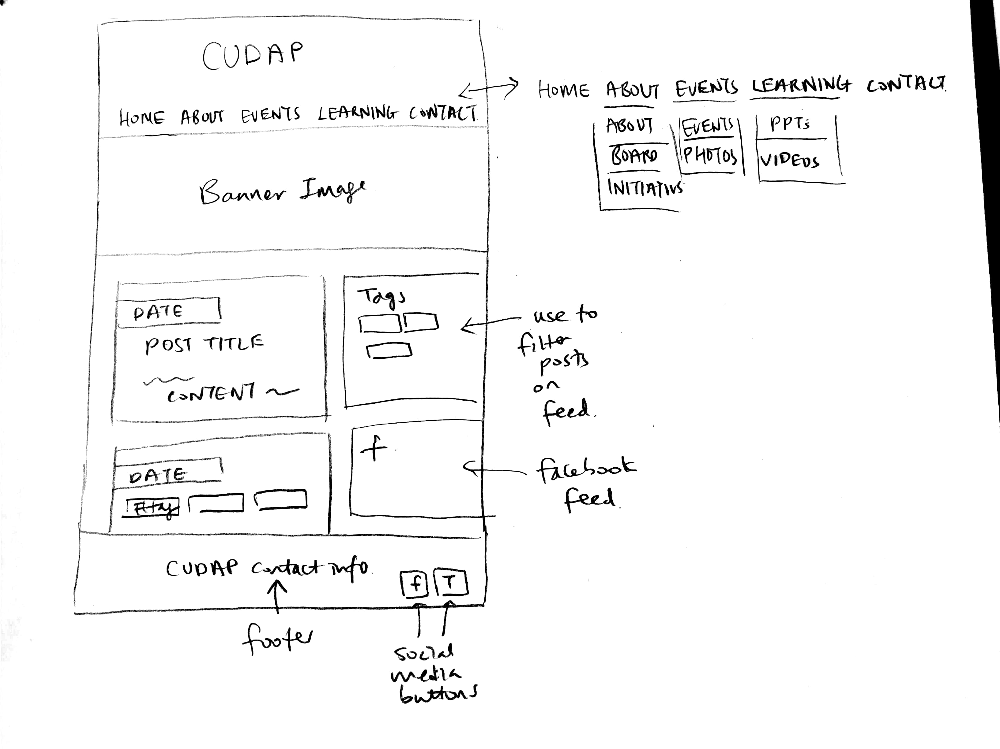

# Project 4 - Design & Plan

Your Team Name: Red Elephant

## Milestone 1, Part II: Client Selection

### Client Description

Our client will be CUDAP, the Cornell University Deaf Awareness Project, which is a club under SAFC and the Public Service Center. CUDAP was created 7 years ago when there was an emergency situation in Ithaca and someone needed an interpreter, but there was none available. Then, a Cornell student stepped in who was not certified, and thus CUDAP was founded. CUDAP provides students with opportunities to learn about and participate in raising awareness concerning the issues facing the Deaf community through meetings, service trip, events, and incorporating ASL into the school-year curriculum at Cornell.

The club part of this program involves general body meetings, where the members present a powerpoint of signs with a theme to increase awareness of ASL and teach popular songs in ASL and perform them, and they conduct workshops with different groups on campus. CUDAP just recently brought SA initiative 41 (establishing American Sign Language ASL classes to fulfill the foreign languages requirement at Cornell) to the Student Assembly and it passed unanimously!

CUDAP would like a website that is user-friendly and promotes more interaction with their program for students, club members, and Ithaca residents by announcing events, teaching some basic signs, and providing contact information. One of their goals is to also have a website that can be updated easily with an admin feature so they don't have to code.

These are some main ideas that CUDAP would like us to promote in our website:
	- Increasing awareness, recruiting, getting more involved
	- Accessible to the community, not just the club

Some possible pages of our website:
	- About page *** need to have ***
	- Meet the Board page (contact info) *** need to have ***
	- G-body info, events --> a NewsFeed maybe? Instead of an announcements page
	- Photo gallery
	- Information page with links to different resources
	- A learning page for a crash-course of Sign Language → few common signs displayed for better User Experience

The key goals of CUDAP are stated in their three-fold mission:
1. Work to integrate the Deaf and hearing communities
2. Work to provide an opportunity for students to learn about the Deaf community and American Sign Language (ASL) through meetings, service trips, and events, while educating the Cornell campus and the greater Ithaca community to facilitate a better understanding of the Deaf community.
3. Aim to incorporate ASL into the school-year curriculum at Cornell University.

Existing website: http://orgsync.rso.cornell.edu/org/cudap/home

Screenshot: 

Update the site: The website is currently run through OrgSync, which is a platform that limits user choices. We plan on redesigning the content of the website in a more eye-appealing manner. Also, we plan on restructuring the pages on the website and adding a "learning" page where CUDAP can control uploading a picture of a sign and it's meaning. The homepage will feature a feed where they can announce current happenings with the program or promote Deaf awareness in other ways. We will be making this website mobile-friendly and implementing a header instead. Lastly, we will be including a log-in feature for the admin to update existing board members, photo galleries, the homepage feed, and the learning page.


## Milestone 1, Part III: Client Requirements

### Target Audience(s)

The potential audiences for this website will include anyone who wants to know about the deaf community & ASL experience, potential people interested in the club, people already involved with the club and are members, alumni of the program, officers of the club (admins), and Ithaca residents.

For the people who would want to learn more about the deaf community, they would not necessarily have an affiliation with Cornell or want to be involved in the program, so they would use this website as an informative site.

Potential people who are interested in the club would probably use the website most during the beginning of semesters around club fest. They would also utilize the "sign up for the listserv" feature.

Members of the club and alumni could use the website as supplemental to the weekly emails that the program sends out. They would also use it to keep up with events.

The officers would need to access the website from an admin portal to update content like officers, pictures, posts, and learning material.

Ithaca residents would use this website year round for if they wanted to contact the club for some reason or become involved with events offered by the program.

### Purpose & Content

The purpose of this website will be...
* promoting CUDAP
* promoting the deaf community and raising awareness
* recruiting for their club
* let members know about events and announcements

CUDAP will be using the website to appeal to their target audiences and display information about what their program offers to increase awareness of the deaf community. For the information portion, there will be a page with pictures of members signing some basic ASL signs as a kind of "crash-course" and to stimulate interest in the club and the deaf movement. The events page will integrate a calendar so the audience can get involved if they choose. Additionally, the website will include the student involvement side (the club aspect) and explain what they do on campus, introduce their e-board, and show action pictures.

### Needs and Wants

* Needs/Wants #1
	* **Needs and Wants**
		* Client is required to have an About page to satisfy requirements as an organization under the Public Services Center, and wants the flexibility to change this information
	* **Design Ideas and Choices**
		* Create an About page that describes the organization and its goals and initiatives
		* Keep the structure of this page simple and allow webmaster to change the text in HTML if changes are needed
		* Create an Update About Page with HTML form on the website which can only be accessed by members who can log in to the admin pages
	* **Memo**
		* We will allow the webmaster to make changes via an HTML form, but also leave instructions as to how changes in HTML can be made. The club has members well versed in programming languages, so maintaining the website should not be a difficult task


* Needs/Wants #2
	* **Needs and Wants**
		* Client would like the ability to update the Meet the Board page for each new E-board
	* **Design Ideas and Choices**
		* Allow webmaster to make changes in HTML
		* Create an Update E-board page as an admin page that can only be viewed members of the e-board. Provide an HTML form that allows users to delete existing members and another form for adding the new e-board (name, email, description, photo)
	* **Memo**
		* Both options are viable, but it is probably better to allow updates to be made on the admin pages for a more user-friendly interface, and to prevent code from being tampered with. We want to make this website self-sustaining so that even those unfamiliar with HTML/CSS/PHP have the ability to make changes when necessary


* Needs/Wants #3
	* **Needs and Wants**
		* Client wants a learning page to share ASL resources with members and the general public
	* **Design Ideas and Choices**
		* Create a page and display links to different websites
		* Create a photo gallery with different pictures of signs and allow users to hover over it/click on it to see its meaning
	* **Memo**
		* We think that the second option would be more effective because it is attention-grabbing and different from how websites usually present information
		* We could still display relevant links at the bottom of the page for those who are interested in delving deeper


* Needs/Wants #4
	* **Needs and Wants**
		* Client would like a calendar to list organization events on the website
	* **Design Ideas and Choices**
		* Embed a Google calendar onto one of the pages
		* Create a list of events on one of the pages, providing date, time, and event details
	* **Memo**
		* We will likely embed the Google calendar in the version of the website that we submit to the client, but create a list of events for the website that we submit for class to satisfy project requirements


### Hosting Plan

We will not be hosting our website for the client, as stated by the requirements of this project. But we can give them the files for the website and they can host the website. We have notified the client of this.

### Client's Edits

Yes. We will implement different forms for changing/updating the content of the website for the admins. For instance, our website would have a form for uploading different content on the feeds/announcement section in the home page (only visible/accessible by admins)

### Information Architecture, Content, and Navigation

* Content #1
  * **Main Navigation**
		* Home
    * About
			* Initiatives
      	* Goal 1
      	* Goal 2, etc
    * Meet the Board
    * Sign Choir
  * **Content**
		* *Home*: This page shall contain some general photos of the club, a feed system that displays information about the organization's upcoming events and/or announcements. The closest 5 events and announcements will be shown, but the user will be given the opportunity to expand the list of events if they so choose (if we choose to implement this functionality). Each event shall have a title, time, location, and brief description. These events will be provided by the client.
    * *About*: The About link in the main navigation should like to the About page necessitated by Public Services Center requirements which contains general information about the organization, its goals, and its initiatives. This information will be obtained from the client.
    * *Meet the Board*: A link to this page shall be displayed in a dropdown menu that appears when About is hovered over. This page will contain photos and short bios for each of the organization's eboard members. These photos and bios will be obtained from the client. As for the initiatives, the organization has a few major goals (project initiatives), and each one will have its own bullet describing the goal, the steps that have been taken to reach the goal, the steps that the organization plans to take to reach the goal, and how far they are to reaching the goal. The information for this page will be provided by the client.
    * *Sign Choir*: This page should contain information about the organization's Gbody meetings including where and when they are held, and the activities conducted at the meetings. This information will be obtained from the client.

  * Content #2
    * **Main Navigation**
      * Learning
    * **Content**
      * Learning: This page shall contain the various resources that the organization provides for people who are interested in learning ASL. It will incorporate an interactive gallery of signs which displays the meaning of each sign when it is hovered over. It will also contain links to external resources for more advanced study.
			* Events: This page will contain a table of events that are coming up.

  * Content #3
    * **Main Navigation**
      * Photo Gallery
    * **Content**
		This page will contain a gallery and slideshow of photos taken during their events and activities. These photos will be provided by the client.

  * Content #4
    * **Main Navigation**
      * Contact
    * **Content**
      * This page shall contain contact information for important members of the eboard, and contain information on who to contact for whatever purpose. It should also contain a contact form.

### Interactivity

We will implement a slideshow using Javascript, which the user can click arrows to view several images of the club activities like sign choirs and photos of club members interacting with one another in sign language. Such feature can help induce interest in potential club members and also to increase awareness of American Sign Language in people who view these photos.

We will use PHP to implement a "learning" page where users can learn some basic signs of ASL, and there will be several images with different signs and when user clicks on it, the website would display information on what it means, etc. This interactive feature will help CUDAP achieve one of their main goals of providing an opportunity for students to learn about sign language.

Lastly, we will implement a hidden log-in system to ensure that only admins will have access to admin functionality (forms for changing content on website). There will most likely be an "admin-only" nav bar button that shows the log-in form, which only the admins will know the password to log-in and unlock admin functionality.

### External Code

We are planning to use jQuery, so that we can implement the slideshow mentioned in previous section. There will be a whole new file of our own code called "slideshow.js" that would contain the code for implementing a simple slideshow for our photo gallery.

### Scale

The site will contain 10 pages, but this number is subject to change. We estimate that the project will take approximately 150 hours to complete. This includes time for planning, designing, building, and testing the website with our client and target audience.

## Milestone 1, Part IV: Work Distribution

Initial planning and preparation work has been equally divided between all team members.

In order to ensure a fair distribution of work and an equal learning experience for all group members, we aim to distribute some design, front end development, back end development, and testing responsibilities to all team members. However, in order to most effectively leverage the specific skills of each team member, a larger proportion of the work distributed to each team member will be under a category that that person is skilled at.

For instance, if Autumn is a strong designer, she will hold a larger proportion of design responsibilities than other team members, but will still have programming and testing responsibilities.

Specific work distributions are listed below (subject to change):

| Autumn | Lucy | Bethany | Derek |
|----------------------------------------|------------------------------------------------|-------------------|--------------------------------------------------------|
| Talking with the client, learning page | Forms, interactive component (slideshow, etc.) | CSS, style/layout | Admin-specific features (hidden features, login, etc.) |

*These are our main responsibilities, but we will all work on the code and design distributively.*

- Log in feature implemented by certain time, most likely before end of April
- We need to create databases first before we can get started working on the photo gallery and the learning page.
- We will first need the basic  website before we do admin-specific hidden features with the log-in and hidden elements.

**Preliminary timeline (subject to change):**

| Deadline/Date | Action |
|---------------|-----------------------------------------------------|
| 4/17 | Milestone 1 submission |
| 4/20 | Discuss preliminary sketches and database structure |
| 4/23 | Review wireframes |
| 4/24 | Milestone 2 submission |
| 4/26 | Complete basic website structure |
| 4/29 | Implement HTML page layouts and CSS |
| 4/31 | Implement login system and add client content |
| 5/1 | Milestone 3 submission |
| 5/3 | Make presentation |
| 5/4 | Milestone 4: present in lab |
| 5/8 | Implement front-end dynamic features |
| 5/12 | Implement back-end (admin) dynamic features |
| 5/13 | Implement any extra features |
| 5/15 | Review and bug test |
| 5/16 | Milestone 5: final submission |

This section will be updated as we set more concrete tasks to complete.


## Milestone 1, Part V: Additional Comments

CUDAP would like to have an events page on their website. Given that CUDAP already has a Google Calendar to keep track of their events, and that such functionality is already very effectively implemented by Google Calendar, the ideal way to implement the events page is to use the Google Calendar API. However, since this does not conform to the final project rules, we will be implementing two versions of the event page. One version will be a PHP implementation backed by an events table in our database. This will be submitted for the class. A second version will use the Google Calendar API, and this will be delivered to the client.


## Milestone 2, Part I: PHP Interactivity

[Describe here what you plan to do for your PHP Interactivity requirement.]
* gallery?
* feed with tags?

## Milestone 2, Part II: Sketches, Navigation & Wireframes

### Sketches

About: 

Meet the Board: 

Home/Feed: 

Gallery: 

Events: 

Learning: 

Contact: 

### Navigation

[What will be your top-level pages and your sub-pages for those top-level pages? What will your website's navigational structure?]

[Tip: If you use card sorting for your navigation, show us that work by including a picture!]

These will be the pages we are planning on
* Home (top-level)
* About
  * What is CUDAP?
	* Initiatives
* Events
* Photos
* Learn
* Sign Choir
* Meet the Board
  * Admin Portal
* Contact

We plan to implement a navigation menu that will be our header. However, when the width of the browser gets below a minimum width set, we will collapse the navigation bar.

### Wireframes

[Insert your wireframes here.]

Learning: 

## Milestone 2, Part III: Evaluate your Design

[Use the GenderMag method to evaluate your wireframes.]

[Pick a persona that you believe will help you address the gender bias within your design.]

I've selected **[Abby/Patricia/Patrick/Tim]** as my persona.

I've selected my persona because... [Tell us why you picked your persona in 1-3 sentences. Your explanation should include why your persona will help you address gender-inclusiveness bugs in your design.]

### Tasks

[You will need to evaluate at least 3 tasks (known as scenarios in the GenderMag literature). List your tasks here. These tasks are the same as the task you learned in INFO/CS 1300.]

[For each task, list the ideal set of actions that you would like your users to take when working towards the task.]

Task 1: [describe your task]

  1. [action 1...]
  2. [action 2...]
  3. ...

Task 2:

Task 3:

### Cognitive Walkthrough

[Perform a cognitive walkthrough using the GenderMag method for all of your Tasks. Use the GenderMag template in the <documents/gendermag-template.md> file.]

#### Task 1 - Cognitive Walkthrough

[copy the GenderMag template here and conduct a cognitive walkthrough to evaluate your design (wireframes).]

[You may need to add additional subgoals and/or actions for each task.]

#### Task 2 - Cognitive Walkthrough


#### Task 3 - Cognitive Walkthrough


### Cognitive Walk-though Results

[Did you discover any issues with your design? What were they? How did you change your design to address the gender-inclusiveness bugs you discovered?]

[Your responses here should be very thorough and thoughtful.]

## Milestone 2, Part IV: Database Plan

### Database Schema

[Describe the structure of your database. You may use words or a picture. A bulleted list is probably the simplest way to do this.]

Table: execboard
* field 1: id - primary key (necessary?)
* field 2: name - name of executive board member
* field 3: position - position of member
* field 4: major - major of student
* field 5: classyear - year member is graduating
* field 6: year - year started signing (can write a formula for how many years of experience from this number)
* field 7: description

Table: learn
* field 1: id - primary key
* field 2: sign - word being signed
* field 3: background - blurb providing background for sign
* field 4: image - file path of image showing this sign

photo Gallery

feed gallery


### Database Queries

[Plan your database queries. You may use natural language, pseudocode, or SQL.]

## Milestone 2, Part V: Structure and Pseudocode

### Structure

[List the PHP files you will have. You will probably want to do this with a bulleted list.]

* index.php - main page.
* includes/init.php - stuff that useful for every web page.
* TODO

### Pseudocode

[For each PHP file, plan out your pseudocode. You probably want a subheading for each file.]

#### index.php

```
Pseudocode for index.php...

include init.php

TODO
```

#### includes/init.php

```
messages = array to store messages for user (you may remove this)

// DB helper functions (you do not need to write this out since they are provided.)

db = connect to db

...

```

## Milestone 2, Part VI: Additional Comments

[Add any additional comments you have here.]


## Milestone 3: Updates

[If you make any changes to your plan or design, make a list of the changes here.]


## Milestone 4: Updates

[If you make any changes to your plan or design based on your peers' feedback, make a list of the changes here.]


## Milestone 5: Cognitive Walkthrough

[Copy your tasks here from Milestone 2. Update them if you need to and then conduct another cognitive walkthrough.]

### Cognitive Walk-though Results

[Did you discover any issues with your design? What were they? How did you change your design to address the gender-inclusiveness bugs you discovered?]

[Your responses here should be very thorough and thoughtful.]

## Milestone 5: Final Notes to the Clients

[Describe in some detail what the client will do (or would have to do) in order to make this website go live. What is the deployment plan?]

[Include any other information that your client needs to know about your final website design. For example, what client wants or needs were unable to be realized in your final product? Why were you unable to meet those wants/needs?]

## Milestone 5: Final Notes to the Graders

[1. Give us three specific strengths of your site that sets it apart from the previous website of the client (if applicable) and/or from other websites. Think of this as your chance to argue for the things you did really well.]

Design (looks bad now)

[2. Tell us about things that don't work, what you wanted to implement, or what you would do if you keep working with the client in the future. Give justifications.]

[3. Tell us anything else you need us to know for when we're looking at the project.]
